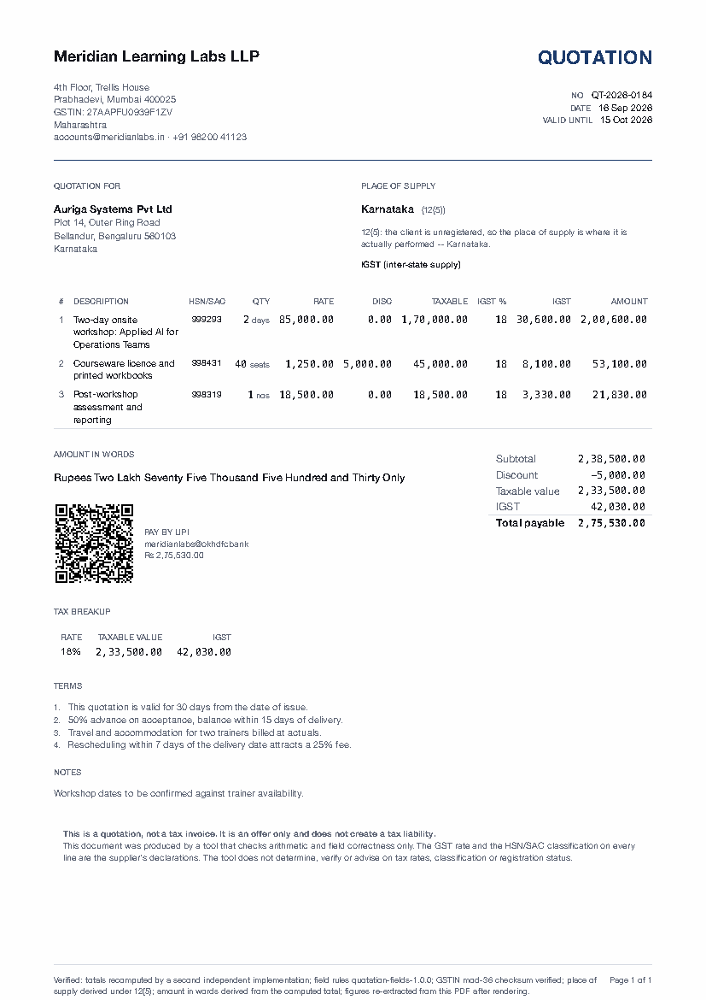
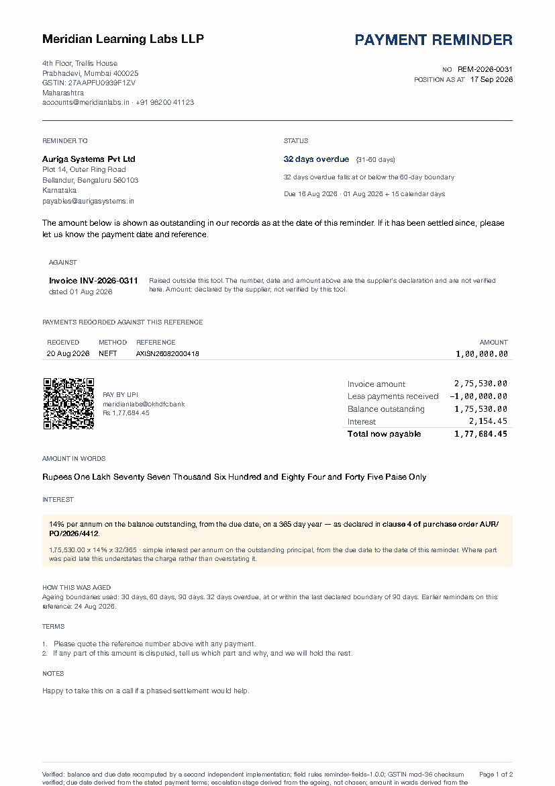
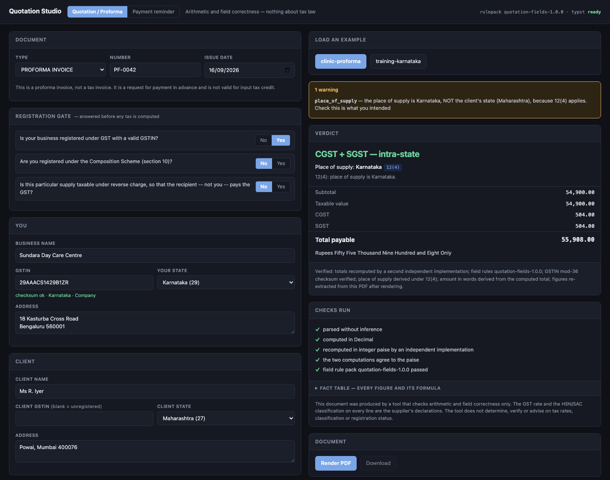
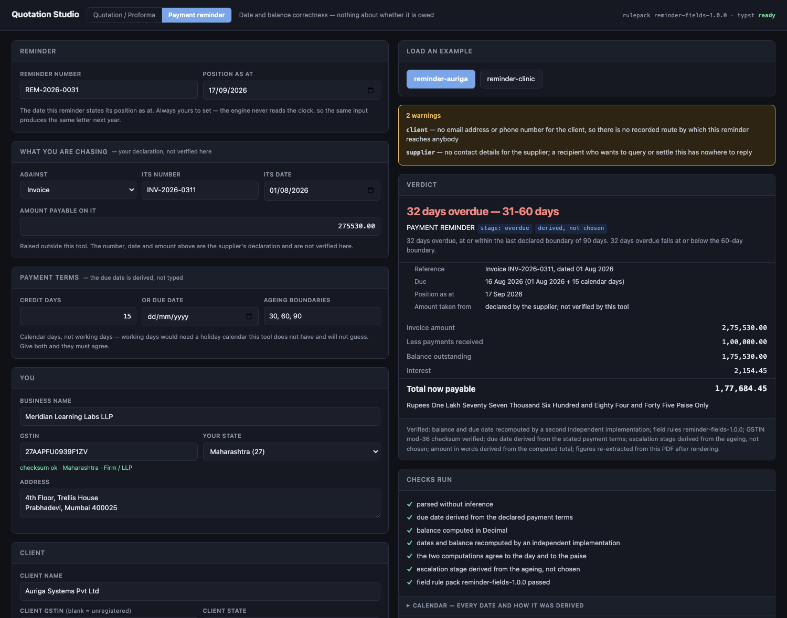

# Quotation Studio

**GST quotations, proforma invoices and payment reminders for Indian businesses — where every figure is computed twice, every date is derived rather than typed, and nothing is handed to you until it has been read back off the rendered page.**


<p align="center">
  
  
</p>

---

## The problem

Most quotation tools are a template with a spreadsheet behind it. They will happily produce a document that is wrong, and it will look exactly as convincing as one that is right. The three ways that happens in Indian GST work are well known:

1. **The arithmetic is silently wrong.** Floating-point money, a total rounded before its parts, a CGST/SGST split that does not add back to the tax. Nobody notices until a client's accounts team re-adds the column.
2. **The place of supply is a dropdown.** It is set to "the client's state", which is right most of the time — and wrong in exactly the cases these businesses hit. A trainer delivering a workshop to an *unregistered* client charges tax based on where the workshop happened, not where the client's office is. The document still looks perfect while charging the wrong tax.
3. **The tool guesses.** It picks 18% for you, fills in an HSN code inferred from the description, and now a number you never checked is on a document with your name on it.

## What this does instead

It **refuses**. When it does not know something that carries meaning — the GST rate, the classification, your registration status, your payment terms — it stops and names the field rather than choosing on your behalf. And when it does compute something, it computes it twice, by two implementations that share no code, then checks that the rendered PDF actually says what was computed.

If any check fails you get **nothing** — not a degraded document, not a watermarked one, not one with a warning stamped on it. Nothing, plus the name of the field to fix.

```
Refused. 1 field(s) must be fixed:

  items[0].hsn_sac
    an HSN (goods) or SAC (services) code is required. This is your
    classification -- the tool will not choose one for you
    ITM-001

No document was produced.
```

## Who it is for

Small Indian service businesses that raise their own paperwork and have no finance team to catch a mistake:

| You are | You hit |
|---|---|
| A trainer or workshop provider | Place of supply under 12(5) — it follows the client's registration status, and moves when they are unregistered |
| A consultant, designer or agency on retainers | 12(2), plus chasing invoices that get paid in parts |
| A clinic, salon, gym or caterer | 12(4) — performance-based, and often an unregistered individual as the client |
| An event organiser | 12(6) and 12(7) — admission and organising are different rules |
| Anyone shipping goods | 10(1)(a)/(b)/(c) — bill-to/ship-to is not the same as where it lands |
| Anyone waiting to be paid | Ageing that has to hold up when the client's accounts team queries it |

## What it produces

Three documents, two claims.

| | Document | Claim |
|---|---|---|
| **Quotation** | An offer. Creates no tax liability. | Arithmetic and field correctness |
| **Proforma invoice** | A request for payment in advance. Not valid for input tax credit. | Arithmetic and field correctness |
| **Payment reminder** | A statement of position against either, or against an invoice you raised elsewhere. | Date and balance correctness |

It **cannot** produce a tax invoice. `DocumentType` has exactly two members, the string does not exist in the codebase outside disclaimers, and a test fails the build if anyone adds it. Enabling it needs a practising CA to review a CGST Rule 46 pack and sign the changelog.

---

## Quickstart

```bash
git clone <this-repo> && cd AI_TOOLKIT
pip install -e ".[dev]"
```

Rendering needs the [**typst**](https://github.com/typst/typst/releases) binary — it is not a Python package. Install it, or point `TYPST_BIN` at it. Everything except rendering works without it.

```bash
# a verified quotation
quotation-studio render examples/training-karnataka.json -o out/QT-2026-0184.pdf

# a verified payment reminder
quotation-studio remind examples/reminder-auriga.json -o out/REM-2026-0031.pdf

# the questions the tool asks, and why it asks them
quotation-studio ask
```

Or run the local UI:

```bash
pip install -e ".[web]"
python3 -m webapp                 # http://127.0.0.1:8000
```

<p align="center">
  
  <br><em>Document mode — the tax split, the provision that decided it, and every check that ran</em>
</p>

<p align="center">
  
  <br><em>Reminder mode — the ageing leads, and the escalation stage is derived rather than chosen</em>
</p>

The browser computes nothing. Every figure on screen is a preformatted string from the same engine the CLI uses, and every refusal is the engine's own, pinned to the field it named.

---

## The three things it refuses to guess

### 1. Place of supply is a questionnaire, not a dropdown

You answer *what you are supplying*, and the place of supply is **derived** — with the provision that decided it printed on the document, so a recipient can check the reasoning instead of trusting it.

| You supply | Rule | Place of supply |
|---|---|---|
| Training or a workshop | 12(5) | Registered client → their state. **Unregistered client → where you deliver it.** |
| Work on a building or site | 12(3) | Where the property is |
| Clinic, salon, gym, restaurant, catering | 12(4) | Where you perform it |
| Event admission | 12(6) | Where the event is held |
| Organising an event | 12(7) | Registered client → their state; otherwise the venue |
| Consulting, design, software, retainers | 12(2) | The client's location |
| Goods you ship | 10(1)(a) | Where delivery ends |
| Goods on bill-to/ship-to | 10(1)(b) | The buyer's principal place of business |
| Goods collected, or not moved | 10(1)(c) | Where the goods are |
| Anything else | — | You state it, and the document records that you did |

The consequence is real. Same supplier, same client, same venue — only the client's registration status differs:

```
client unregistered -> PoS Karnataka     IGST 42,030.00
client registered   -> PoS Maharashtra   CGST 21,015.00 + SGST 21,015.00
```

When a carve-out moves the place of supply away from the client's state, the tool warns you on the spot.

### 2. The registration gate

Three questions, asked before any tax is computed:

1. Is your business registered under GST with a valid GSTIN?
2. Are you registered under the Composition Scheme (section 10)?
3. Is this supply taxable under reverse charge?

An unregistered supplier who charges GST is committing an offence; a composition dealer who does so is committing a different one. A template will do either silently. This will not: leave any question unanswered and it refuses to compute tax at all, and a composition or unregistered supplier gets a zero-tax document carrying the required statutory declaration.

### 3. The escalation stage of a reminder

There is no field that asks how firm the letter should be. The stage is **derived** from how overdue the money is, against boundaries you declare, and the boundary that placed it is printed on the page. A dropdown here would let a final reminder go out on a bill that is not yet due, and the document would look entirely correct doing it.

---

## What is provable, and how

### Quotations and proformas — arithmetic and field correctness

| Claim | How it is made checkable by someone who does not trust us |
|---|---|
| The money is right | Every figure is computed twice by two implementations that share no code — `Decimal` with explicit rounding, and exact rationals reduced to integer paise. They must agree to the paise or nothing renders. |
| The CGST/SGST split is right | Each half is exactly half the line's tax, odd paise to CGST, so `CGST + SGST == tax` exactly. Checkable on a phone calculator. |
| The GSTIN is well-formed | 15-character structure, PAN holder-type character, valid state code, Luhn mod-36 check digit. No single-character typo in the first 14 gets through (exhaustively tested). |
| The amount in words matches | Generated *from* the computed total, then re-derived and compared after render. Never typed, never model-written. |
| The document says what was computed | `pdfplumber` reads the PDF back. Every line value, every total, the words line, the place-of-supply rule and the statutory declaration must be present and equal. Any mismatch **deletes the PDF**. |
| No figure was invented | Every rupee-formatted token found in the rendered PDF must be one the engine computed. A number nobody computed is a failure. |

### Payment reminders — date and balance correctness

| Claim | How it is made checkable |
|---|---|
| The due date is right | Derived from the reference date plus your declared credit days, never typed. Computed twice — once through the calendar, once through a serial day number built from the civil date by hand. A leap-year or month-boundary bug would have to exist in both. |
| Days overdue is right | `as_of − due_date` in calendar days, where `as_of` is always an explicit input. The engine never calls `date.today()`, so the same JSON produces the same reminder next year — the only way anyone can check the one you sent last year. |
| The balance is right | `amount due − payments recorded`, cross-checked in integer paise. Overpayment or a nil balance is a refusal, not a reminder for nothing. |
| The tone is not a choice | The stage is derived from the ageing, and printed with the reason that produced it. |
| The letter says what was computed | Same read-back: every figure, every date, the words line, the ageing status and the disclaimer must be present and equal, or the PDF is deleted. |

### What neither claims

It is **structurally unable** to tell you anything about tax law, and it says so on every document it produces.

- **It does not know your GST rate.** 5/12/18/28 is your declaration on every line. Omit it and the tool refuses rather than guessing.
- **It does not know your HSN/SAC classification.** Also your declaration. It only checks the code is 4, 6 or 8 digits.
- **It cannot verify a GSTIN is real or active.** A valid checksum means the string is not mistyped. Only the GST portal knows the rest.
- **It does not know whether you were paid.** No bank feed, no UPI reconciliation. A reminder states the position over the payments *you* declared.
- **It computes no interest unless you declare it** — a rate *and* where you agreed it, which is printed on the letter. Whether interest is chargeable at all is a matter of your contract or of statute, and the tool has no view on either.
- **A reminder is not a legal notice.** `ReminderStage` has three members and none is a demand under any statute. The language of one does not exist in the codebase, a test fails the build if it appears, and the rendered bytes are searched for it before release.

---

## How the refusal is made enforceable

The ordering is the point. Nothing reaches a renderer that has not already been computed twice and rule-checked, and nothing reaches you that has not been read back off the page.

```
1  parse    strings to a model; no inference, no defaults that carry meaning
2a compute  Decimal, line by line, every figure carrying its formula
2b verify   independent recomputation; must agree to the paise (and to the day)
3  rules    field pack; a BLOCK names the field and ends it here
4a render   Typst; the template does no arithmetic at all
4b verify   read the PDF back; a mismatch deletes it
```

`run()` walks a quotation or proforma through those stages. `remind()` walks a reminder through the identical four, with the calendar in the place the tax split occupies.

This is not theoretical. Two bugs were caught by stage 4b during development and never shipped: a wrapped amount-in-words line that PDF extraction interleaved with the totals column, and a disclaimer split across a page boundary with the footer landing between its halves. Neither is visible to the computation.

### The manifest footer

Every document carries a line naming which checks actually ran:

> Verified: totals recomputed by a second independent implementation; field rules quotation-fields-1.0.0; GSTIN mod-36 checksum verified; place of supply derived under 12(5); amount in words derived from the computed total; figures re-extracted from this PDF after rendering.

It is a verification manifest, not a logo — proof a recipient can act on.

---

## Usage

### CLI

```bash
quotation-studio render examples/training-karnataka.json -o out/quote.pdf
quotation-studio check  examples/training-karnataka.json      # rules only, no render
quotation-studio facts  examples/training-karnataka.json      # every figure + its formula
quotation-studio facts  examples/training-karnataka.json --json

quotation-studio remind examples/reminder-auriga.json -o out/reminder.pdf
quotation-studio ageing examples/reminder-auriga.json         # the calendar + the balance
quotation-studio ageing examples/reminder-auriga.json --json

quotation-studio gstin  27AAPFU0939F1ZV
quotation-studio ask                                          # the questions, and why
```

### Python

```python
from quotation_studio import run, remind

result = run(payload, out_pdf="quote.pdf")
result.computed.grand_total       # Decimal('275530')
result.computed.amount_words      # 'Rupees Two Lakh Seventy Five ... Only'
for w in result.warnings:
    print(w.field, w.message)

reminder = remind(payload, out_pdf="reminder.pdf")   # omit out_pdf to compute only
reminder.computed.days_overdue    # 32
reminder.computed.stage.value     # 'overdue' -- derived, not chosen
reminder.computed.outstanding     # Decimal('175530.00')
```

### Web UI

```bash
python3 -m webapp --port 8000
```

Then `http://127.0.0.1:8000`, or `?mode=reminder` to open straight on the reminder form. The form is built from the engine's own questionnaires at runtime (`/api/schema`), so the UI cannot drift out of step with the rules.

### Input

See `examples/`. Money and quantities are given as **strings** — floats are rejected outright, because `0.1 + 0.2` has no place in an invoice. Dates are ISO only: `03/04/2026` means two different days in two different countries and the tool will not choose one.

**A document** needs `doc_type`, `number`, `issue_date`, `supplier`, `client`, `registration` (all three answers), `place_of_supply` (`nature` plus any follow-up), and `items` — each with `description`, `hsn_sac`, `quantity`, `rate` and `gst_rate`.

**A reminder** needs `number`, `as_of`, `supplier`, `client`, `reference` (`kind`, `number`, `dated`, and `amount` unless `source_document` is supplied), and either `credit_days` or `due_date`. Optional: `payments`, `interest`, `ageing_buckets`, `history`, `source_document`, `terms`, `notes`, `upi_id`.

A reminder chases either a proforma this tool produced — supply the original as `source_document` and the engine recomputes its total rather than trusting a retyped figure — or a document you raised elsewhere, whose number, date and amount are recorded and printed as your declaration.

### Exit codes

| Code | Meaning |
|---|---|
| 0 | Document produced and verified |
| 2 | Refused — your input has a problem, and the named field says which |
| 3 | Refused — an internal check failed. A bug in the tool; no document was produced |
| 4 | Cannot render — typst not found |

---

## Project layout

```
quotation_studio/            the engine
  model.py  compute.py       the document: parse, then Decimal arithmetic
  recompute.py               the independent integer-paise second implementation
  place_of_supply.py         the questionnaire and the derivation
  registration.py            the three-question gate
  gstin.py  words.py         checksum validation; number to words
  rules.py                   the document field pack
  receivable.py  ageing.py   the reminder: model, then calendar and balance
  redates.py                 the independent day-number second implementation
  reminder_rules.py          the reminder field pack
  render*.py  verify*.py     Typst in, PDF read back out
  pipeline.py                the four stages, in the order that makes refusal enforceable
  cli.py                     the command line

templates/                   document.typ, reminder.typ -- no arithmetic anywhere in them
webapp/                      FastAPI + a dependency-free browser UI
examples/                    four worked inputs
tests/                       the suite
```

## Tests

```bash
python3 -m pytest -q
```

662 tests. The ones worth knowing about:

- **400 randomised documents** cross-checked between the two money implementations
- **An exhaustive single-character corruption test** over the GSTIN checksum — every possible typo in the first 14 characters must be caught
- **5,000 random dates** round-tripped between the calendar and the day-number implementation, plus every ageing boundary and escalation stage compared across four bucket schemes
- **A blocked document leaves no file behind** — checked on disk, not asserted in the abstract
- **A template that drops the disclaimer is caught** by the read-back
- **Two structural guards** that fail the build outright: `test_no_tax_invoice.py` if "Tax Invoice" appears outside a disclaimer, and `test_no_legal_notice.py` if the language of a legal demand appears outside a denial

Those last two are the ones to be careful with. They are not style checks — they are the mechanism that keeps the tool's claims honest, and a change that trips them needs a human decision, not a test update.

## Roadmap

Not yet built, roughly in order of usefulness:

- **Send-ready reminder text** for email, WhatsApp and SMS — with the Send-Safe/TRAI gate that electronic channels need (DLT headers, consent, quiet hours) and which a PDF you attach yourself does not
- **Statement of account** across several open receivables for one client
- **Proposal DOCX** — the "Proposal" third of the original name
- **Client and item registers** with a numbering series. Reminders are deliberately **stateless** today: what was sent before is supplied in `history` and nothing is stored between runs. A register changes that, and it is this tool's only real privacy exposure — it needs a retention policy before it is built
- Tally/Zoho CSV export, Hindi reminders, own-logo branding

## Contributing

The refusals are the product. Before relaxing one, check whether it is load-bearing:

- **Never add a default for something that carries meaning.** A GST rate, an HSN code, a due date or an interest rate that the tool supplies is a number nobody checked, on a document with the user's name on it.
- **Never let a figure reach a template unless it was computed twice.** If you add a computation, add its counterpart in `recompute.py` or `redates.py` — by a genuinely different method, not a copy with the names changed.
- **Never let a document out that was not read back.** New fields on the page need matching assertions in `verify.py` or `reminder_verify.py`.
- **The two guard tests are not negotiable** without the review each one names.

## Licence

No licence file yet — which by default means all rights reserved, so nobody else may legally use this. Worth deciding before the repository goes public: MIT for maximum reuse, Apache-2.0 if you want an explicit patent grant.

## Disclaimer

This software checks arithmetic, dates and document fields. It does not provide tax, legal or financial advice, it does not determine or verify GST rates, HSN/SAC classification or registration status, and it does not know whether any sum it helps you chase is actually owed. Those are your declarations and your responsibility. Consult a qualified professional.
